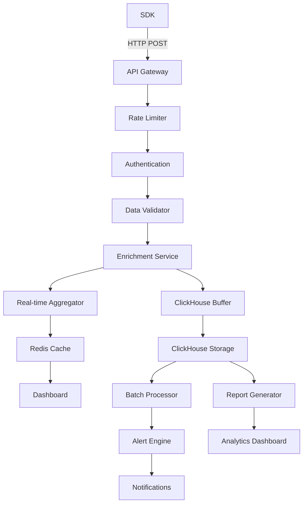

# Product Requirements Document: API Analytics

## TL;DR

Build a comprehensive API analytics system that tracks and analyzes API request telemetry including hit rates, response codes, request durations, rate limiting, payload sizes, and other performance metrics. This system will provide developers with deep insights into their API usage patterns and performance characteristics.

## 1. Overview

### 1.1 Problem Statement

Developers building APIs need visibility into how their endpoints are performing, being used, and where bottlenecks occur. Currently, most analytics platforms focus on web traffic but lack specialized tooling for API monitoring. Developers need to understand:

- Which endpoints are most/least used
- Response time patterns and performance bottlenecks
- Error rates and failure patterns
- Rate limiting effectiveness
- Request payload characteristics
- Geographic distribution of API consumers
- Authentication patterns and security metrics

### 1.2 Solution

Implement a comprehensive API analytics platform that:

- Tracks detailed request/response telemetry via SDK integration
- Provides real-time and historical API performance insights
- Offers endpoint-specific analytics and monitoring
- Supports multiple programming languages and frameworks
- Integrates seamlessly with existing authentication systems
- Provides actionable insights for API optimization

### 1.3 Success Metrics

- **SDK Adoption**: 500+ API integrations within 6 months
- **Data Accuracy**: >99.5% successful telemetry capture rate
- **Performance Impact**: <5ms average overhead per API request
- **User Engagement**: 70% of users actively use API analytics features
- **Customer Satisfaction**: >4.5/5 rating for API analytics functionality

## 2. User Stories & Requirements

### 2.1 Core User Stories

**As an API developer, I want to:**

- Monitor real-time API performance and usage patterns
- Identify slow endpoints and performance bottlenecks
- Track error rates and understand failure patterns
- Monitor rate limiting effectiveness and adjust limits
- Analyze request payload sizes and optimize data transfer
- View geographic distribution of API consumers
- Set up alerts for performance degradation or errors

**As a DevOps engineer, I want to:**

- Monitor API health across multiple environments
- Track deployment impact on API performance
- Set up automated alerts for critical issues
- Generate SLA reports for API uptime and performance
- Monitor resource utilization and scaling needs

**As a product manager, I want to:**

- Understand which API features are most popular
- Track API adoption and usage growth
- Identify opportunities for API optimization
- Generate reports for stakeholders and customers
- Monitor customer API usage patterns

### 2.2 Functional Requirements

#### 2.2.1 Core Metrics Tracking

- **Request Metrics**: Count, rate, concurrent requests
- **Response Times**: Min, max, average, percentiles (P50, P95, P99)
- **Status Codes**: 2xx, 3xx, 4xx, 5xx breakdown and trends
- **Error Tracking**: Error types, frequency, and patterns
- **Rate Limiting**: Hits, blocks, remaining quota
- **Payload Analysis**: Request/response sizes, content types
- **Authentication**: Success/failure rates, token usage patterns

#### 2.2.2 Advanced Analytics

- **Endpoint Performance**: Per-endpoint metrics and comparisons
- **Geographic Analytics**: Request origins and latency by region
- **User Agent Analysis**: Client application and version tracking
- **Time-based Analysis**: Hourly, daily, weekly, monthly trends
- **Custom Dimensions**: User-defined metadata and segmentation
- **Correlation Analysis**: Performance vs. payload size, geography, etc.

#### 2.2.3 Real-time Monitoring

- **Live Dashboard**: Real-time metrics and status indicators
- **Alert System**: Threshold-based alerts for critical metrics
- **Health Checks**: Automated endpoint availability monitoring
- **Performance Budgets**: Set and monitor performance targets
- **Anomaly Detection**: Automatic detection of unusual patterns

#### 2.2.4 SDK Requirements

- **Multi-language Support**: JavaScript/Node.js, Python, Go, Rust, Java, PHP
- **Framework Integration**: Express, FastAPI, Gin, Actix, Spring Boot, Laravel
- **Minimal Overhead**: <5ms per request, async data transmission
- **Configurable**: Sampling rates, metric selection, filtering
- **Reliable**: Graceful failure handling, offline queuing

### 2.3 Non-Functional Requirements

- **Performance**: <5ms overhead per tracked request
- **Scalability**: Support 1M+ requests per minute per customer
- **Reliability**: 99.99% uptime for analytics infrastructure
- **Security**: End-to-end encryption, secure API key management
- **Compliance**: GDPR, SOC 2, data residency requirements

## 3. Technical Architecture

### 3.1 System Components

#### 3.1.1 API Analytics Engine

```typescript
interface APIAnalyticsEngine {
  collector: TelemetryCollector;
  processor: DataProcessor;
  storage: AnalyticsStorage;
  aggregator: MetricsAggregator;
  alerting: AlertingService;
}

interface APIRequest {
  id: string;
  websiteId: string;
  apiKeyId: string;
  timestamp: number;

  // Request details
  method: "GET" | "POST" | "PUT" | "DELETE" | "PATCH" | "OPTIONS" | "HEAD";
  endpoint: string;
  path: string;
  queryParams?: Record<string, string>;
  headers: Record<string, string>;
  requestSize: number;
  contentType?: string;

  // Response details
  statusCode: number;
  responseTime: number;
  responseSize: number;
  responseContentType?: string;

  // Client information
  userAgent?: string;
  ipAddress: string;
  country?: string;
  region?: string;
  city?: string;

  // Authentication
  authMethod?: "api_key" | "bearer_token" | "basic_auth" | "none";
  userId?: string;

  // Rate limiting
  rateLimitHit: boolean;
  rateLimitRemaining?: number;
  rateLimitReset?: number;

  // Custom metadata
  customDimensions?: Record<string, string>;
  tags?: string[];

  // Error details
  errorType?: string;
  errorMessage?: string;
  stackTrace?: string;
}
```

#### 3.1.2 Data Storage Schema

```sql
-- API requests telemetry (ClickHouse)
CREATE TABLE analytics.api_requests (
  id UUID,
  website_id String,
  api_key_id String,
  timestamp DateTime64(3, 'UTC'),

  -- Request details
  method LowCardinality(String),
  endpoint String,
  path String,
  query_params String, -- JSON encoded
  request_size Int32,
  content_type Nullable(String),

  -- Response details
  status_code Int16,
  response_time_ms Int32,
  response_size Int32,
  response_content_type Nullable(String),

  -- Client information
  user_agent Nullable(String),
  ip_address String,
  country Nullable(String),
  region Nullable(String),
  city Nullable(String),

  -- Authentication
  auth_method LowCardinality(Nullable(String)),
  user_id Nullable(String),

  -- Rate limiting
  rate_limit_hit UInt8,
  rate_limit_remaining Nullable(Int32),
  rate_limit_reset Nullable(DateTime64(3, 'UTC')),

  -- Custom data
  custom_dimensions String, -- JSON encoded
  tags Array(String),

  -- Error tracking
  error_type Nullable(String),
  error_message Nullable(String),

  created_at DateTime64(3, 'UTC')
) ENGINE = MergeTree()
PARTITION BY toYYYYMM(timestamp)
ORDER BY (website_id, api_key_id, timestamp, endpoint);

-- API key configurations (PostgreSQL)
CREATE TABLE api_analytics_config (
  id UUID PRIMARY KEY,
  website_id STRING NOT NULL,
  api_key_id STRING NOT NULL REFERENCES apikey(id),

  -- Tracking configuration
  enabled BOOLEAN DEFAULT true,
  sampling_rate FLOAT DEFAULT 1.0, -- 0.0 to 1.0
  track_headers BOOLEAN DEFAULT false,
  track_query_params BOOLEAN DEFAULT true,
  track_request_body BOOLEAN DEFAULT false,
  track_response_body BOOLEAN DEFAULT false,

  -- Custom dimensions
  custom_dimensions JSONB DEFAULT '{}',
  tags STRING[] DEFAULT '{}',

  -- Performance budgets
  response_time_budget_ms INT DEFAULT 1000,
  error_rate_budget_percent FLOAT DEFAULT 5.0,

  created_at TIMESTAMP DEFAULT NOW(),
  updated_at TIMESTAMP DEFAULT NOW()
);

-- API endpoints registry
CREATE TABLE api_endpoints (
  id UUID PRIMARY KEY,
  website_id STRING NOT NULL,

  -- Endpoint details
  method STRING NOT NULL,
  path_pattern STRING NOT NULL, -- e.g., /api/users/{id}
  endpoint_name STRING, -- Human-readable name
  description TEXT,

  -- Categorization
  category STRING, -- e.g., 'authentication', 'users', 'payments'
  tags STRING[] DEFAULT '{}',

  -- Configuration
  enabled BOOLEAN DEFAULT true,
  deprecated BOOLEAN DEFAULT false,
  version STRING,

  -- Performance expectations
  expected_response_time_ms INT,
  expected_error_rate_percent FLOAT,

  created_at TIMESTAMP DEFAULT NOW(),
  updated_at TIMESTAMP DEFAULT NOW(),

  UNIQUE(website_id, method, path_pattern)
);
```

### 3.2 SDK Architecture

#### 3.2.1 Core SDK Interface

```typescript
interface DatabuddyAPIAnalytics {
  // Initialization
  init(config: AnalyticsConfig): void;

  // Manual tracking
  trackRequest(request: APIRequestData): void;
  trackError(error: APIErrorData): void;

  // Middleware integration
  middleware(): MiddlewareFunction;

  // Configuration
  setCustomDimension(key: string, value: string): void;
  addTag(tag: string): void;
  setSamplingRate(rate: number): void;

  // Utilities
  flush(): Promise<void>;
  disable(): void;
  enable(): void;
}

interface AnalyticsConfig {
  apiKey: string;
  websiteId: string;
  endpoint?: string; // Default to Databuddy API
  samplingRate?: number; // Default 1.0
  batchSize?: number; // Default 100
  flushInterval?: number; // Default 5000ms
  enableAutoTracking?: boolean; // Default true
  customDimensions?: Record<string, string>;
  tags?: string[];
}
```

#### 3.2.2 Language-Specific Implementations

**Node.js/Express Example:**

```javascript
const { DatabuddyAPIAnalytics } = require("@databuddy/api-analytics");

const analytics = new DatabuddyAPIAnalytics({
  apiKey: "db_live_...",
  websiteId: "website_123",
  customDimensions: {
    service: "user-api",
    version: "1.2.0",
  },
});

// Middleware integration
app.use(analytics.middleware());

// Manual tracking
app.post("/api/users", async (req, res) => {
  const startTime = Date.now();

  try {
    const user = await createUser(req.body);

    analytics.trackRequest({
      method: "POST",
      endpoint: "/api/users",
      statusCode: 201,
      responseTime: Date.now() - startTime,
      requestSize: JSON.stringify(req.body).length,
      responseSize: JSON.stringify(user).length,
      customDimensions: {
        userType: user.type,
      },
    });

    res.status(201).json(user);
  } catch (error) {
    analytics.trackError({
      method: "POST",
      endpoint: "/api/users",
      errorType: error.constructor.name,
      errorMessage: error.message,
      statusCode: 500,
      responseTime: Date.now() - startTime,
    });

    res.status(500).json({ error: "Internal server error" });
  }
});
```

**Rust/Actix Example:**

```rust
use databuddy_api_analytics::{DatabuddyAnalytics, AnalyticsConfig, AnalyticsMiddleware};

#[actix_web::main]
async fn main() -> std::io::Result<()> {
    let analytics = DatabuddyAnalytics::new(AnalyticsConfig {
        api_key: "db_live_...".to_string(),
        website_id: "website_123".to_string(),
        custom_dimensions: HashMap::from([
            ("service".to_string(), "user-api".to_string()),
            ("version".to_string(), "1.2.0".to_string()),
        ]),
        ..Default::default()
    });

    HttpServer::new(move || {
        App::new()
            .wrap(AnalyticsMiddleware::new(analytics.clone()))
            .route("/api/users", web::post().to(create_user))
    })
    .bind("127.0.0.1:8080")?
    .run()
    .await
}

async fn create_user(
    req: web::Json<CreateUserRequest>,
    analytics: web::Data<DatabuddyAnalytics>
) -> Result<impl Responder, Error> {
    let start_time = Instant::now();

    match user_service::create_user(&req).await {
        Ok(user) => {
            analytics.track_request(APIRequestData {
                method: "POST".to_string(),
                endpoint: "/api/users".to_string(),
                status_code: 201,
                response_time: start_time.elapsed().as_millis() as u32,
                custom_dimensions: HashMap::from([
                    ("user_type".to_string(), user.user_type.clone()),
                ]),
                ..Default::default()
            }).await;

            Ok(web::Json(user))
        },
        Err(e) => {
            analytics.track_error(APIErrorData {
                method: "POST".to_string(),
                endpoint: "/api/users".to_string(),
                error_type: "UserCreationError".to_string(),
                error_message: e.to_string(),
                status_code: 500,
                response_time: start_time.elapsed().as_millis() as u32,
                ..Default::default()
            }).await;

            Err(actix_web::error::ErrorInternalServerError(e))
        }
    }
}
```

### 3.3 Integration Points

#### 3.3.1 Existing Databuddy Infrastructure

- **API Keys**: Extend existing API key system for authentication
- **Database**: Use PostgreSQL for configuration, ClickHouse for telemetry
- **Authentication**: Integrate with existing auth system
- **Rate Limiting**: Leverage existing rate limiting infrastructure
- **Alerting**: Extend existing notification system

#### 3.3.2 Data Processing Pipeline



## 4. User Interface Design

### 4.1 API Analytics Dashboard

- **Overview Cards**: Total requests, average response time, error rate, top endpoints
- **Real-time Metrics**: Live request rate, response time trends, error spikes
- **Endpoint Performance**: Table with per-endpoint metrics and health status
- **Geographic Map**: Request origins and latency by region
- **Time-series Charts**: Configurable metrics over time with zoom/pan
- **Alert Status**: Active alerts and recent notifications

### 4.2 Endpoint Details View

- **Performance Metrics**: Response time percentiles, throughput trends
- **Status Code Distribution**: Pie chart and trend analysis
- **Error Analysis**: Error types, frequency, and recent occurrences
- **Request Characteristics**: Payload sizes, content types, user agents
- **Geographic Distribution**: Heat map of request origins
- **Rate Limiting**: Usage patterns and limit effectiveness

### 4.3 API Key Management

- **Key Configuration**: Enable/disable tracking, sampling rates
- **Performance Budgets**: Set and monitor SLA targets
- **Custom Dimensions**: Define and manage custom metadata
- **Endpoint Registry**: Manage endpoint names and categorization
- **Alert Rules**: Configure threshold-based alerts

### 4.4 Real-time Monitoring

- **Live Dashboard**: Real-time metrics with auto-refresh
- **Alert Center**: Active alerts with acknowledge/resolve actions
- **Health Status**: Overall API health with traffic light indicators
- **Performance Timeline**: Recent performance events and anomalies

## 5. Implementation Plan

### Phase 1: Core Infrastructure (6 weeks)

- [ ] Database schema design and migration
- [ ] API telemetry ingestion endpoint
- [ ] Basic ClickHouse storage and querying
- [ ] API key authentication and authorization
- [ ] Core Node.js SDK development
- [ ] Basic dashboard with overview metrics

### Phase 2: Advanced Analytics (5 weeks)

- [ ] Real-time aggregation and caching
- [ ] Endpoint-specific analytics
- [ ] Geographic enrichment service
- [ ] Alert system implementation
- [ ] Performance budgets and SLA tracking
- [ ] Advanced dashboard features

### Phase 3: Multi-language SDKs (6 weeks)

- [ ] Python SDK (FastAPI, Flask, Django)
- [ ] Go SDK (Gin, Echo, Chi)
- [ ] Rust SDK (Actix, Warp, Axum)
- [ ] Java SDK (Spring Boot, Micronaut)
- [ ] PHP SDK (Laravel, Symfony)
- [ ] SDK documentation and examples

### Phase 4: Enterprise Features (4 weeks)

- [ ] Custom dimensions and tagging
- [ ] Advanced alerting rules
- [ ] Data export and API access
- [ ] Webhook integrations
- [ ] Team management and permissions
- [ ] White-label options

### Phase 5: Optimization & Scale (3 weeks)

- [ ] Performance optimization
- [ ] Auto-scaling infrastructure
- [ ] Advanced monitoring and observability
- [ ] Load testing and capacity planning
- [ ] Documentation and training materials

## 6. API Specifications

### 6.1 Telemetry Ingestion

```typescript
// Ingest API telemetry
POST /api/v1/analytics/requests
Authorization: Bearer {api_key}
Content-Type: application/json

{
  websiteId: string;
  requests: APIRequest[];
}

// Batch error reporting
POST /api/v1/analytics/errors
Authorization: Bearer {api_key}
Content-Type: application/json

{
  websiteId: string;
  errors: APIError[];
}
```

### 6.2 Analytics Queries

```typescript
// Get API metrics
GET /api/v1/analytics/metrics?websiteId={id}&startDate={date}&endDate={date}&endpoint={path}

// Get endpoint performance
GET /api/v1/analytics/endpoints?websiteId={id}&timeRange=7d

// Get real-time metrics
GET /api/v1/analytics/realtime?websiteId={id}

// Get geographic distribution
GET /api/v1/analytics/geography?websiteId={id}&timeRange=24h
```

### 6.3 Configuration Management

```typescript
// Update analytics configuration
PUT / api / v1 / analytics / config / { websiteId };
{
  samplingRate: number;
  customDimensions: Record<string, string>;
  performanceBudgets: {
    responseTime: number;
    errorRate: number;
  }
}

// Manage endpoints
POST / api / v1 / analytics / endpoints;
{
  websiteId: string;
  method: string;
  pathPattern: string;
  name: string;
  category: string;
}
```

## 7. SDK Examples

### 7.1 Automatic Middleware Integration

```javascript
// Express.js
const express = require("express");
const { DatabuddyAPIAnalytics } = require("@databuddy/api-analytics");

const app = express();
const analytics = new DatabuddyAPIAnalytics({
  apiKey: process.env.DATABUDDY_API_KEY,
  websiteId: process.env.DATABUDDY_WEBSITE_ID,
});

app.use(analytics.middleware());
```

### 7.2 Manual Tracking

```python
# Python/FastAPI
from databuddy_api_analytics import DatabuddyAnalytics
import time

analytics = DatabuddyAnalytics(
    api_key=os.getenv("DATABUDDY_API_KEY"),
    website_id=os.getenv("DATABUDDY_WEBSITE_ID")
)

@app.post("/api/users")
async def create_user(user: UserCreate):
    start_time = time.time()

    try:
        result = await user_service.create_user(user)

        await analytics.track_request({
            "method": "POST",
            "endpoint": "/api/users",
            "status_code": 201,
            "response_time": int((time.time() - start_time) * 1000),
            "custom_dimensions": {
                "user_type": result.type
            }
        })

        return result
    except Exception as e:
        await analytics.track_error({
            "method": "POST",
            "endpoint": "/api/users",
            "error_type": type(e).__name__,
            "error_message": str(e),
            "status_code": 500
        })
        raise
```

### 7.3 Configuration Options

```go
// Go
package main

import (
    "github.com/databuddy/api-analytics-go"
    "github.com/gin-gonic/gin"
)

func main() {
    analytics := databuddy.New(databuddy.Config{
        APIKey:    os.Getenv("DATABUDDY_API_KEY"),
        WebsiteID: os.Getenv("DATABUDDY_WEBSITE_ID"),
        SamplingRate: 0.1, // Track 10% of requests
        CustomDimensions: map[string]string{
            "service": "user-api",
            "version": "1.0.0",
        },
        Tags: []string{"production", "user-service"},
    })

    r := gin.Default()
    r.Use(analytics.Middleware())

    r.Run(":8080")
}
```

## 8. Security Considerations

### 8.1 Data Protection

- **API Key Security**: Secure generation, storage, and rotation
- **Data Encryption**: End-to-end encryption for telemetry data
- **Access Control**: Role-based permissions for analytics access
- **Data Retention**: Configurable retention policies
- **PII Handling**: Automatic detection and masking of sensitive data

### 8.2 Privacy Compliance

- **GDPR Compliance**: Data processing consent and deletion rights
- **Data Residency**: Geographic data storage options
- **Anonymization**: IP address hashing and user ID obfuscation
- **Audit Logging**: Track all data access and modifications

## 9. Pricing & Business Model

### 9.1 Pricing Tiers

- **Free Tier**: 100K requests/month, 7-day retention, basic analytics
- **Pro Tier**: 1M requests/month, 30-day retention, advanced analytics
- **Business Tier**: 10M requests/month, 90-day retention, custom dimensions
- **Enterprise Tier**: Unlimited requests, custom retention, white-label

### 9.2 Usage Metrics

- Number of tracked API requests
- Data retention period
- Number of custom dimensions
- Advanced features (alerts, exports, etc.)
- Team members and permissions

## 10. Success Metrics & KPIs

### 10.1 Technical Metrics

- **SDK Performance**: <5ms average overhead per request
- **Data Accuracy**: >99.5% successful telemetry capture
- **System Reliability**: >99.99% uptime for analytics infrastructure
- **Query Performance**: <500ms for dashboard queries

### 10.2 Adoption Metrics

- **SDK Downloads**: Track adoption across languages
- **Active Integrations**: Number of actively reporting APIs
- **Data Volume**: Total requests tracked per month
- **Feature Usage**: Utilization of advanced features

### 10.3 Business Metrics

- **Customer Acquisition**: New customers using API analytics
- **Revenue Impact**: Revenue from API analytics features
- **Customer Satisfaction**: NPS score for API analytics
- **Support Efficiency**: Reduction in API-related support tickets

## 11. Risk Assessment & Mitigation

### 11.1 Technical Risks

- **Performance Impact**: Minimize SDK overhead through async processing
- **Data Loss**: Implement redundant storage and backup systems
- **Scalability Issues**: Design for horizontal scaling from day one
- **SDK Reliability**: Graceful failure handling and offline queuing

### 11.2 Business Risks

- **Competitive Pressure**: Focus on deep integration with existing platform
- **Adoption Challenges**: Provide excellent documentation and examples
- **Privacy Concerns**: Implement strong privacy controls and transparency
- **Support Overhead**: Build comprehensive self-service tools

## 12. Future Enhancements

### 12.1 Advanced Analytics

- **Machine Learning**: Anomaly detection and predictive insights
- **Performance Optimization**: Automated recommendations
- **Load Testing Integration**: Synthetic monitoring capabilities
- **Business Intelligence**: Connect API metrics to business outcomes

### 12.2 Integration Expansions

- **APM Integration**: Connect with New Relic, DataDog, etc.
- **CI/CD Integration**: Performance testing in deployment pipelines
- **Documentation Generation**: Auto-generate API docs from usage
- **GraphQL Support**: Specialized analytics for GraphQL APIs

### 12.3 Enterprise Features

- **Multi-tenant Architecture**: Isolated analytics per customer
- **Custom Dashboards**: Drag-and-drop dashboard builder
- **Advanced Alerting**: ML-powered intelligent alerting
- **Compliance Reporting**: Automated compliance and audit reports

---

**Document Version**: 1.0  
**Last Updated**: January 2025  
**Next Review**: February 2025  
**Owner**: Product Team  
**Stakeholders**: Engineering, Design, Developer Relations, Customer Success
