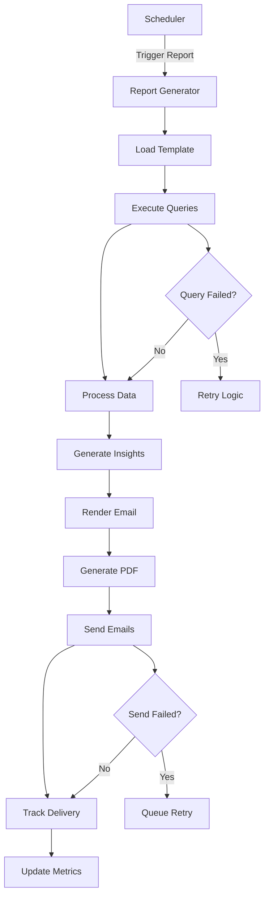

# Product Requirements Document: Automated Analytics Reports

## TL;DR

Build a comprehensive automated reporting system that generates and delivers personalized analytics reports via email, integrating with Databuddy's existing query builders and email infrastructure to provide users with regular insights about their website performance.

## 1. Overview

### 1.1 Problem Statement

Currently, Databuddy users need to manually log into the dashboard to view their analytics data. Many users want regular, automated insights delivered to their inbox without having to actively check the dashboard. This creates friction in staying informed about website performance and can lead to missed opportunities or issues going unnoticed.

### 1.2 Solution

Implement a comprehensive automated reporting system that:

- Generates beautiful, branded analytics reports using existing query builders
- Delivers reports via email on customizable schedules (daily, weekly, monthly)
- Provides personalized insights and trend analysis
- Supports multiple report types and customizable content
- Integrates seamlessly with existing analytics infrastructure

### 1.3 Success Metrics

- **Report Delivery Success**: >99.5% successful email delivery rate
- **User Engagement**: >40% email open rate, >15% click-through rate
- **Feature Adoption**: 35% of active websites have automated reports enabled within 6 months
- **User Retention**: 25% increase in user retention for customers using automated reports
- **Customer Satisfaction**: >4.3/5 rating for report quality and usefulness

## 2. User Stories & Requirements

### 2.1 Core User Stories

**As a website owner, I want to:**

- Receive weekly summaries of my website's performance via email
- Get alerted when significant changes occur in my analytics
- Customize which metrics are included in my reports
- Schedule different types of reports for different stakeholders
- Export and share reports with my team
- View historical report archives

**As a marketing manager, I want to:**

- Receive campaign performance reports after each campaign ends
- Get monthly executive summaries with key business metrics
- Compare performance across different time periods
- Receive alerts when conversion goals are met or missed
- Share automated reports with clients and stakeholders

**As a developer, I want to:**

- Monitor error rates and performance metrics automatically
- Receive alerts when error thresholds are exceeded
- Get detailed technical reports for performance optimization
- Track the impact of deployments on website metrics

### 2.2 Functional Requirements

#### 2.2.1 Report Types

- **Executive Summary**: High-level KPIs, trends, and insights
- **Detailed Analytics**: Comprehensive breakdown of all metrics
- **Performance Report**: Page load times, Core Web Vitals, errors
- **Traffic Analysis**: Sources, campaigns, geographic data
- **Conversion Report**: Goals, funnels, and conversion rates
- **Error Monitoring**: JavaScript errors, failed requests
- **Custom Reports**: User-defined metric combinations

#### 2.2.2 Scheduling & Delivery

- **Flexible Scheduling**: Daily, weekly, bi-weekly, monthly, quarterly
- **Custom Time Ranges**: Last 7 days, last month, custom periods
- **Multiple Recipients**: Send to teams, stakeholders, clients
- **Timezone Support**: Reports generated in user's timezone
- **Delivery Preferences**: Email format (HTML/PDF), mobile optimization

#### 2.2.3 Customization Features

- **Metric Selection**: Choose which analytics to include
- **Branding Options**: Custom logos, colors, company information
- **Content Filters**: Filter by pages, campaigns, geographic regions
- **Comparison Periods**: Week-over-week, month-over-month analysis
- **Insight Generation**: AI-powered insights and recommendations

#### 2.2.4 Alert System

- **Threshold Alerts**: Notify when metrics exceed defined limits
- **Anomaly Detection**: Alert on unusual traffic patterns
- **Goal Notifications**: Celebrate when targets are achieved
- **Error Alerts**: Immediate notification of critical errors
- **Performance Degradation**: Alert when site speed declines

### 2.3 Non-Functional Requirements

- **Performance**: Report generation <30 seconds for standard reports
- **Reliability**: 99.9% uptime for report generation service
- **Scalability**: Support 100,000+ scheduled reports
- **Security**: Secure handling of analytics data and email delivery
- **Compliance**: GDPR, CAN-SPAM compliant email practices

## 3. Technical Architecture

### 3.1 System Components

#### 3.1.1 Report Engine

```typescript
interface ReportEngine {
  scheduler: ReportScheduler;
  generator: ReportGenerator;
  renderer: EmailRenderer;
  deliveryService: EmailDeliveryService;
}

interface ReportTemplate {
  id: string;
  name: string;
  type: "executive" | "detailed" | "performance" | "traffic" | "custom";
  sections: ReportSection[];
  schedule: ReportSchedule;
  recipients: string[];
  customization: ReportCustomization;
}

interface ReportSection {
  id: string;
  title: string;
  queryType: keyof typeof QueryBuilders;
  chartType?: "line" | "bar" | "pie" | "metric";
  filters?: Filter[];
  timeRange: TimeRange;
  includeComparison: boolean;
}
```

#### 3.1.2 Data Storage Schema

```sql
-- Report templates and configurations
CREATE TABLE report_templates (
  id UUID PRIMARY KEY,
  website_id STRING NOT NULL,
  user_id STRING NOT NULL,
  name STRING NOT NULL,
  description TEXT,
  type STRING NOT NULL, -- 'executive', 'detailed', 'performance', 'traffic', 'custom'

  -- Scheduling
  schedule_type STRING NOT NULL, -- 'daily', 'weekly', 'monthly', 'quarterly'
  schedule_day INT, -- Day of week (1-7) or month (1-31)
  schedule_time TIME DEFAULT '09:00:00',
  timezone STRING DEFAULT 'UTC',

  -- Recipients
  recipients JSONB NOT NULL, -- [{"email": "user@example.com", "name": "John Doe"}]

  -- Content configuration
  sections JSONB NOT NULL, -- Array of ReportSection objects
  customization JSONB, -- Branding, colors, logos

  -- Status
  enabled BOOLEAN DEFAULT true,
  last_sent_at TIMESTAMP,
  next_scheduled_at TIMESTAMP,

  created_at TIMESTAMP DEFAULT NOW(),
  updated_at TIMESTAMP DEFAULT NOW()
);

-- Report execution history
CREATE TABLE report_executions (
  id UUID PRIMARY KEY,
  template_id UUID NOT NULL REFERENCES report_templates(id),
  website_id STRING NOT NULL,

  -- Execution details
  executed_at TIMESTAMP NOT NULL,
  status STRING NOT NULL, -- 'pending', 'generating', 'sent', 'failed'
  generation_time_ms INT,

  -- Report data
  report_data JSONB, -- Generated report content
  email_subject STRING,
  recipients_sent JSONB, -- Array of successfully sent recipients

  -- Metrics
  email_opens INT DEFAULT 0,
  email_clicks INT DEFAULT 0,

  -- Error handling
  error_message TEXT,
  retry_count INT DEFAULT 0,

  created_at TIMESTAMP DEFAULT NOW()
);

-- Report metrics and insights
CREATE TABLE report_insights (
  id UUID PRIMARY KEY,
  execution_id UUID NOT NULL REFERENCES report_executions(id),
  website_id STRING NOT NULL,

  -- Insight data
  insight_type STRING NOT NULL, -- 'trend', 'anomaly', 'achievement', 'recommendation'
  title STRING NOT NULL,
  description TEXT NOT NULL,
  severity STRING, -- 'info', 'warning', 'critical', 'positive'

  -- Supporting data
  metric_name STRING,
  current_value FLOAT,
  previous_value FLOAT,
  change_percentage FLOAT,

  created_at TIMESTAMP DEFAULT NOW()
);

-- Alert configurations
CREATE TABLE report_alerts (
  id UUID PRIMARY KEY,
  website_id STRING NOT NULL,
  user_id STRING NOT NULL,

  -- Alert configuration
  name STRING NOT NULL,
  metric_type STRING NOT NULL, -- 'pageviews', 'bounce_rate', 'errors', etc.
  condition STRING NOT NULL, -- 'greater_than', 'less_than', 'percentage_change'
  threshold_value FLOAT NOT NULL,
  time_period STRING NOT NULL, -- '1h', '24h', '7d'

  -- Notification settings
  recipients JSONB NOT NULL,
  enabled BOOLEAN DEFAULT true,
  last_triggered_at TIMESTAMP,

  created_at TIMESTAMP DEFAULT NOW()
);
```

### 3.2 Integration Points

#### 3.2.1 Existing Databuddy Infrastructure

- **Query Builders**: Leverage existing analytics query system
- **Email Infrastructure**: Extend React Email templates
- **Authentication**: Use existing user and website permissions
- **Database**: Extend PostgreSQL schema for report configuration
- **ClickHouse**: Query analytics data for report generation
- **Redis**: Cache report data and manage job queues

#### 3.2.2 External Services

- **Email Delivery**:
  - Primary: Existing email service (Resend/SendGrid)
  - Fallback: Secondary provider for reliability
- **PDF Generation**: Puppeteer for PDF report exports
- **Image Generation**: Chart.js/D3.js for embedded charts
- **Scheduling**: Cron jobs with Redis-based job queue

### 3.3 Report Generation Workflow



## 4. User Interface Design

### 4.1 Report Management Dashboard

- **Template Gallery**: Pre-built report templates with previews
- **Custom Builder**: Drag-and-drop interface for creating custom reports
- **Schedule Manager**: Calendar view of all scheduled reports
- **Recipient Management**: Manage email lists and stakeholder groups
- **Report History**: Archive of previously sent reports with metrics

### 4.2 Report Builder Interface

- **Section Editor**: Add/remove report sections with live preview
- **Query Configuration**: Visual query builder for custom metrics
- **Design Customization**: Brand colors, logos, and styling options
- **Preview Mode**: Real-time preview of report appearance
- **Test Delivery**: Send test reports before scheduling

### 4.3 Alert Configuration

- **Alert Setup Wizard**: Step-by-step alert creation
- **Threshold Management**: Visual threshold setting with historical context
- **Notification Preferences**: Multi-channel alert delivery options
- **Alert History**: Log of triggered alerts and responses
- **Performance Dashboard**: Alert effectiveness metrics

### 4.4 Email Report Templates

#### 4.4.1 Executive Summary Template

- Header with company branding and date range
- Key metrics cards (visitors, pageviews, bounce rate, conversion rate)
- Traffic trend chart
- Top pages and traffic sources
- Key insights and recommendations
- Footer with links to detailed dashboard

#### 4.4.2 Detailed Analytics Template

- Comprehensive metrics overview
- Traffic sources breakdown with charts
- Geographic analysis with maps
- Device and browser analytics
- Performance metrics and Core Web Vitals
- Error tracking and monitoring
- Custom event analysis

#### 4.4.3 Performance Report Template

- Page speed overview and trends
- Core Web Vitals breakdown
- Slowest pages identification
- Performance by device type
- Error rate analysis
- Recommendations for improvement

## 5. Implementation Plan

### Phase 1: Core Infrastructure (5 weeks)

- [ ] Database schema design and migration
- [ ] Report template system
- [ ] Basic report generator using existing queries
- [ ] Email template creation with React Email
- [ ] Simple scheduling system
- [ ] Basic dashboard for report management

### Phase 2: Advanced Features (4 weeks)

- [ ] Custom report builder interface
- [ ] PDF generation capability
- [ ] Advanced scheduling options
- [ ] Insight generation system
- [ ] Alert system implementation
- [ ] Recipient management

### Phase 3: Intelligence & Optimization (4 weeks)

- [ ] AI-powered insights and recommendations
- [ ] Anomaly detection for alerts
- [ ] Performance optimization
- [ ] Advanced customization options
- [ ] A/B testing for email templates
- [ ] Delivery optimization

### Phase 4: Enterprise Features (3 weeks)

- [ ] White-label branding options
- [ ] Advanced user permissions
- [ ] API access for report data
- [ ] Webhook integrations
- [ ] Advanced analytics on report performance
- [ ] Custom domain support for email delivery

### Phase 5: Scaling & Reliability (2 weeks)

- [ ] Load testing and optimization
- [ ] Failover and redundancy systems
- [ ] Advanced monitoring and alerting
- [ ] Performance dashboards
- [ ] Documentation and training materials

## 6. API Specifications

### 6.1 Report Template Management

```typescript
// Create report template
POST /api/reports/templates
{
  websiteId: string;
  name: string;
  type: 'executive' | 'detailed' | 'performance' | 'traffic' | 'custom';
  schedule: {
    type: 'daily' | 'weekly' | 'monthly' | 'quarterly';
    day?: number;
    time: string;
    timezone: string;
  };
  recipients: Array<{email: string; name: string}>;
  sections: ReportSection[];
  customization?: ReportCustomization;
}

// Get report templates
GET /api/reports/templates?websiteId={id}

// Update template
PUT /api/reports/templates/{id}

// Delete template
DELETE /api/reports/templates/{id}

// Preview report
POST /api/reports/templates/{id}/preview
```

### 6.2 Report Execution

```typescript
// Send report immediately
POST /api/reports/send/{templateId}

// Get report history
GET /api/reports/executions?websiteId={id}&limit=50

// Get report details
GET /api/reports/executions/{id}

// Download report PDF
GET /api/reports/executions/{id}/pdf
```

### 6.3 Alert Management

```typescript
// Create alert
POST /api/reports/alerts
{
  websiteId: string;
  name: string;
  metricType: string;
  condition: 'greater_than' | 'less_than' | 'percentage_change';
  thresholdValue: number;
  timePeriod: string;
  recipients: Array<{email: string; name: string}>;
}

// Get alerts
GET /api/reports/alerts?websiteId={id}

// Update alert
PUT /api/reports/alerts/{id}

// Test alert
POST /api/reports/alerts/{id}/test
```

## 7. Email Template Examples

### 7.1 Executive Summary Email

```tsx
export const ExecutiveSummaryEmail = ({ reportData, customization }: Props) => {
  return (
    <EmailLayout preview="Your Weekly Analytics Summary">
      <Section>
        <Heading className="text-center text-2xl font-semibold">
          Weekly Analytics Summary
        </Heading>
        <Text className="text-center text-muted-foreground">
          {reportData.dateRange.start} - {reportData.dateRange.end}
        </Text>
      </Section>

      {/* Key Metrics */}
      <Section className="my-6">
        <Row>
          <Column>
            <MetricCard
              title="Visitors"
              value={reportData.metrics.visitors}
              change={reportData.metrics.visitorsChange}
            />
          </Column>
          <Column>
            <MetricCard
              title="Pageviews"
              value={reportData.metrics.pageviews}
              change={reportData.metrics.pageviewsChange}
            />
          </Column>
        </Row>
      </Section>

      {/* Traffic Chart */}
      <Section className="my-6">
        <Heading as="h3">Traffic Trends</Heading>
        
      </Section>

      {/* Insights */}
      <Section className="my-6">
        <Heading as="h3">Key Insights</Heading>
        {reportData.insights.map((insight, index) => (
          <InsightCard key={index} insight={insight} />
        ))}
      </Section>

      {/* CTA */}
      <Section className="text-center">
        <Button
          href={`${customization.dashboardUrl}/websites/${reportData.websiteId}`}
          className="bg-brand text-white px-6 py-3 rounded"
        >
          View Detailed Analytics
        </Button>
      </Section>
    </EmailLayout>
  );
};
```

### 7.2 Performance Alert Email

```tsx
export const PerformanceAlertEmail = ({ alertData, websiteData }: Props) => {
  return (
    <EmailLayout preview={`Performance Alert: ${alertData.metricName}`}>
      <Section>
        <Heading className="text-center text-2xl font-semibold text-red-600">
          Performance Alert
        </Heading>
        <Text className="text-center">
          {websiteData.name} - {websiteData.domain}
        </Text>
      </Section>

      <Section className="my-6 p-4 bg-red-50 rounded">
        <Heading as="h3" className="text-red-800">
          {alertData.title}
        </Heading>
        <Text className="text-red-700">{alertData.description}</Text>

        <Row className="mt-4">
          <Column>
            <Text className="font-semibold">Current Value:</Text>
            <Text className="text-2xl text-red-600">
              {alertData.currentValue}
            </Text>
          </Column>
          <Column>
            <Text className="font-semibold">Threshold:</Text>
            <Text className="text-lg">{alertData.threshold}</Text>
          </Column>
        </Row>
      </Section>

      <Section className="my-6">
        <Heading as="h3">Recommended Actions</Heading>
        {alertData.recommendations.map((rec, index) => (
          <Text key={index} className="mb-2">
            • {rec}
          </Text>
        ))}
      </Section>

      <Section className="text-center">
        <Button
          href={`${websiteData.dashboardUrl}/performance`}
          className="bg-red-600 text-white px-6 py-3 rounded"
        >
          Investigate Issue
        </Button>
      </Section>
    </EmailLayout>
  );
};
```

## 8. Security Considerations

### 8.1 Data Protection

- **Access Control**: Role-based permissions for report access
- **Data Encryption**: Encrypt sensitive report data at rest and in transit
- **Email Security**: SPF, DKIM, DMARC configuration for email delivery
- **Audit Logging**: Track all report access and modifications

### 8.2 Privacy Compliance

- **GDPR Compliance**: Respect user data preferences and deletion requests
- **CAN-SPAM Compliance**: Include unsubscribe links and sender information
- **Data Retention**: Configurable retention policies for report history
- **Consent Management**: Explicit opt-in for automated reports

## 9. Pricing & Business Model

### 9.1 Pricing Tiers

- **Free Tier**: 1 basic report per month, email delivery only
- **Pro Tier**: 10 reports per month, PDF export, basic customization
- **Business Tier**: 50 reports per month, advanced customization, alerts
- **Enterprise Tier**: Unlimited reports, white-label branding, API access

### 9.2 Usage Metrics

- Number of active report templates
- Report generation frequency
- Number of recipients per report
- PDF export usage
- Custom branding features
- Alert configurations

## 10. Success Metrics & KPIs

### 10.1 Technical Metrics

- **Report Generation Success**: >99.5% successful report generation
- **Email Delivery Rate**: >98% successful email delivery
- **Generation Performance**: <30 seconds average generation time
- **System Uptime**: >99.9% availability for report service

### 10.2 User Engagement Metrics

- **Email Open Rate**: Target >40% (industry average ~25%)
- **Click-Through Rate**: Target >15% (industry average ~3%)
- **Report Customization**: % of users who customize default templates
- **Feature Adoption**: % of websites with automated reports enabled

### 10.3 Business Metrics

- **User Retention**: Increase in retention for users with automated reports
- **Upgrade Rate**: % of free users upgrading for reporting features
- **Customer Satisfaction**: NPS score for reporting features
- **Support Reduction**: Decrease in "how do I check my analytics" tickets

## 11. Risk Assessment & Mitigation

### 11.1 Technical Risks

- **Email Deliverability**: Implement multiple email providers and monitoring
- **Report Generation Failures**: Robust error handling and retry mechanisms
- **Performance Issues**: Optimize queries and implement caching
- **Data Accuracy**: Validate report data against dashboard queries

### 11.2 Business Risks

- **Email Fatigue**: Provide easy unsubscribe and frequency controls
- **Low Engagement**: A/B test email designs and content
- **Competitive Pressure**: Focus on unique insights and customization
- **Support Overhead**: Build comprehensive self-service tools

## 12. Future Enhancements

### 12.1 Advanced Analytics

- **Predictive Insights**: Forecast traffic and performance trends
- **Comparative Analysis**: Benchmark against industry standards
- **Cohort Reporting**: Advanced user behavior analysis
- **Revenue Attribution**: Connect analytics to business outcomes

### 12.2 AI/ML Features

- **Smart Insights**: AI-generated insights and recommendations
- **Anomaly Detection**: Automatically detect unusual patterns
- **Content Optimization**: Suggest report content based on user behavior
- **Send Time Optimization**: ML-powered optimal delivery timing

### 12.3 Integration Expansions

- **Slack/Teams Integration**: Send reports to team channels
- **API Webhooks**: Trigger reports from external systems
- **Third-party Data**: Integrate with Google Analytics, social media
- **Business Intelligence**: Connect with Tableau, Power BI, etc.

---

**Document Version**: 1.0  
**Last Updated**: January 2025  
**Next Review**: February 2025  
**Owner**: Product Team  
**Stakeholders**: Engineering, Design, Marketing, Customer Success
