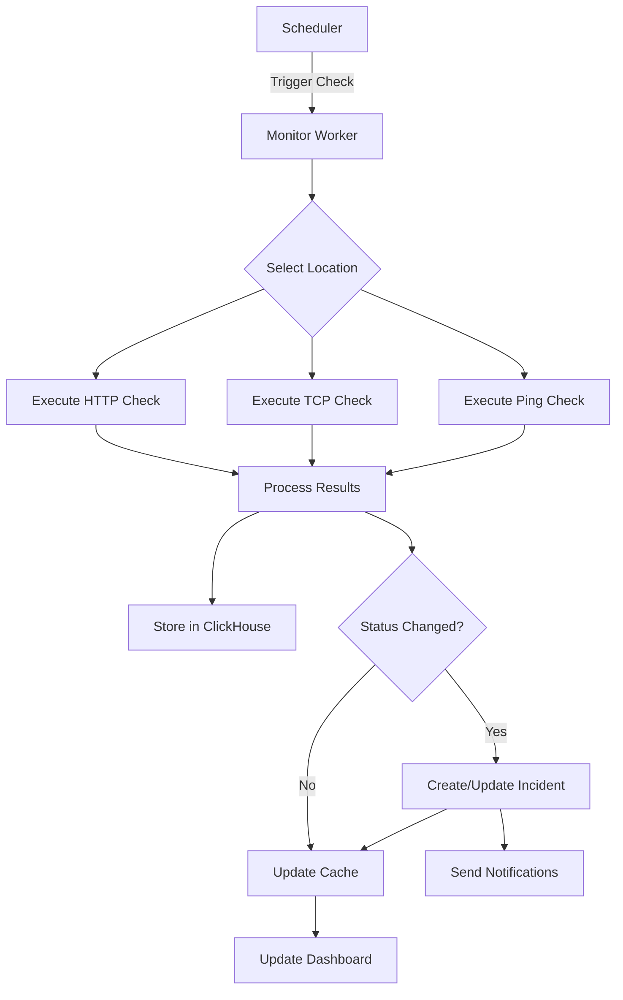

# Product Requirements Document: Status & Uptime Tracking

## TL;DR

Build a comprehensive uptime monitoring and status tracking system that monitors website availability, performance, and health metrics in real-time, integrating seamlessly with Databuddy's existing analytics infrastructure.

## 1. Overview

### 1.1 Problem Statement

Currently, Databuddy provides detailed analytics about user behavior and website performance, but lacks proactive monitoring capabilities to alert users when their websites go down or experience performance issues. Users need visibility into their website's uptime, response times, and overall health status.

### 1.2 Solution

Implement a comprehensive status monitoring system that:

- Monitors website uptime and availability from multiple global locations
- Tracks response times and performance metrics
- Provides real-time alerts and notifications
- Offers historical uptime reporting and SLA tracking
- Integrates with existing Databuddy infrastructure

### 1.3 Success Metrics

- **Uptime Detection Accuracy**: >99.9% accuracy in detecting actual downtime
- **Alert Response Time**: <30 seconds from incident detection to notification
- **False Positive Rate**: <1% of all alerts
- **User Adoption**: 60% of active websites have monitoring enabled within 3 months
- **Customer Satisfaction**: >4.5/5 rating for monitoring reliability

## 2. User Stories & Requirements

### 2.1 Core User Stories

**As a website owner, I want to:**

- Monitor my website's uptime from multiple global locations
- Receive instant notifications when my site goes down
- View historical uptime data and trends
- Track response times and performance metrics
- Set custom monitoring intervals and thresholds
- Generate uptime reports for SLA compliance

**As a development team, I want to:**

- Monitor multiple environments (staging, production, etc.)
- Set up monitoring for API endpoints and services
- Receive detailed incident reports with root cause analysis
- Integrate monitoring data with existing analytics

### 2.2 Functional Requirements

#### 2.2.1 Monitoring Capabilities

- **Multi-location Monitoring**: Check websites from 5+ global locations
- **Protocol Support**: HTTP/HTTPS, TCP, ICMP ping
- **Custom Headers**: Support for authentication headers and custom request parameters
- **SSL Certificate Monitoring**: Track certificate expiration dates
- **Content Verification**: Verify specific content exists on pages
- **API Endpoint Monitoring**: Monitor REST APIs and GraphQL endpoints

#### 2.2.2 Alert System

- **Multi-channel Notifications**: Email, SMS, Slack, Discord, webhooks
- **Smart Alerting**: Prevent alert fatigue with intelligent grouping
- **Escalation Policies**: Route alerts to different teams based on severity
- **Maintenance Windows**: Schedule maintenance to suppress alerts
- **Alert Acknowledgment**: Mark incidents as acknowledged/resolved

#### 2.2.3 Reporting & Analytics

- **Real-time Dashboard**: Live status overview with visual indicators
- **Historical Reports**: Uptime percentage, response time trends
- **SLA Tracking**: Track against custom SLA targets
- **Incident Timeline**: Detailed incident history with duration and impact
- **Performance Metrics**: Response time percentiles, availability zones

### 2.3 Non-Functional Requirements

- **Reliability**: 99.99% uptime for monitoring infrastructure
- **Scalability**: Support 10,000+ monitored endpoints
- **Performance**: <5ms monitoring overhead on checked endpoints
- **Security**: Encrypted monitoring traffic, secure credential storage
- **Compliance**: SOC 2, GDPR compliant data handling

## 3. Technical Architecture

### 3.1 System Components

#### 3.1.1 Monitoring Engine

```typescript
interface MonitoringEngine {
  scheduler: CronScheduler;
  workers: MonitoringWorker[];
  locationManager: GlobalLocationManager;
  resultProcessor: ResultProcessor;
}

interface MonitorCheck {
  id: string;
  websiteId: string;
  url: string;
  method: "GET" | "POST" | "PUT" | "DELETE";
  headers?: Record<string, string>;
  body?: string;
  expectedStatus: number[];
  expectedContent?: string;
  timeout: number;
  interval: number; // seconds
  locations: string[]; // ['us-east', 'eu-west', 'ap-southeast']
}
```

#### 3.1.2 Data Storage Schema

```sql
-- Uptime monitoring checks configuration
CREATE TABLE uptime_monitors (
  id UUID PRIMARY KEY,
  website_id STRING NOT NULL,
  name STRING NOT NULL,
  url STRING NOT NULL,
  method STRING DEFAULT 'GET',
  headers JSONB,
  body TEXT,
  expected_status INT[] DEFAULT [200],
  expected_content STRING,
  timeout_ms INT DEFAULT 30000,
  interval_seconds INT DEFAULT 300,
  locations STRING[] DEFAULT ['us-east-1', 'eu-west-1'],
  enabled BOOLEAN DEFAULT true,
  created_at TIMESTAMP DEFAULT NOW(),
  updated_at TIMESTAMP DEFAULT NOW()
);

-- ClickHouse table for monitoring results
CREATE TABLE analytics.uptime_checks (
  id UUID,
  monitor_id String,
  website_id String,
  location String,
  timestamp DateTime64(3, 'UTC'),

  -- Response metrics
  status_code Nullable(Int32),
  response_time_ms Nullable(Int32),
  dns_time_ms Nullable(Int32),
  connect_time_ms Nullable(Int32),
  ssl_time_ms Nullable(Int32),
  ttfb_ms Nullable(Int32),

  -- Status
  is_up UInt8,
  error_message Nullable(String),
  error_type Nullable(String),

  -- SSL certificate info
  ssl_expires_at Nullable(DateTime64(3, 'UTC')),
  ssl_issuer Nullable(String),

  created_at DateTime64(3, 'UTC')
) ENGINE = MergeTree()
PARTITION BY toYYYYMM(timestamp)
ORDER BY (website_id, monitor_id, timestamp, location);

-- Incidents tracking
CREATE TABLE uptime_incidents (
  id UUID PRIMARY KEY,
  monitor_id UUID NOT NULL,
  website_id STRING NOT NULL,
  started_at TIMESTAMP NOT NULL,
  resolved_at TIMESTAMP,
  duration_seconds INT,
  severity STRING, -- 'critical', 'major', 'minor'
  affected_locations STRING[],
  root_cause TEXT,
  status STRING DEFAULT 'open', -- 'open', 'acknowledged', 'resolved'
  created_at TIMESTAMP DEFAULT NOW()
);
```

### 3.2 Integration Points

#### 3.2.1 Existing Databuddy Infrastructure

- **Authentication**: Use existing auth system for monitor management
- **Database**: Extend PostgreSQL schema for monitor configuration
- **ClickHouse**: Store monitoring results alongside analytics data
- **Redis**: Cache monitoring status and recent results
- **RPC**: Extend tRPC routers for monitoring APIs

#### 3.2.2 External Services

- **Global Monitoring Locations**:
  - AWS Lambda functions in multiple regions
  - Cloudflare Workers for edge monitoring
  - Self-hosted monitoring nodes
- **Notification Services**:
  - Email: Existing email infrastructure
  - SMS: Twilio integration
  - Slack/Discord: Webhook integrations
  - PagerDuty: For enterprise customers

### 3.3 Monitoring Workflow



## 4. User Interface Design

### 4.1 Status Dashboard

- **Overview Cards**: Total uptime %, average response time, active incidents
- **Status Grid**: Visual grid showing all monitored endpoints with color-coded status
- **Response Time Chart**: Real-time response time trends
- **Incident Timeline**: Recent incidents with duration and impact
- **Geographic View**: World map showing monitoring locations and their status

### 4.2 Monitor Configuration

- **Monitor Setup Wizard**: Step-by-step monitor creation
- **Bulk Import**: CSV/JSON import for multiple monitors
- **Advanced Settings**: Custom headers, authentication, content verification
- **Test Runner**: One-click test before saving configuration

### 4.3 Incident Management

- **Incident Details**: Timeline, affected locations, error details
- **Acknowledgment Flow**: Mark incidents as acknowledged/investigating/resolved
- **Post-mortem Templates**: Structured incident reports
- **Communication Hub**: Update status page and notify stakeholders

### 4.4 Reporting Interface

- **Uptime Reports**: Monthly/quarterly uptime summaries
- **SLA Dashboard**: Track against custom SLA targets
- **Performance Trends**: Response time analysis over time
- **Export Options**: PDF reports, CSV data export

## 5. Implementation Plan

### Phase 1: Core Infrastructure (4 weeks)

- [ ] Database schema design and migration
- [ ] Basic monitoring engine with single location
- [ ] ClickHouse table creation and data ingestion
- [ ] Simple HTTP/HTTPS monitoring
- [ ] Basic dashboard with status overview

### Phase 2: Multi-location & Alerting (3 weeks)

- [ ] Global monitoring locations setup
- [ ] Alert system implementation
- [ ] Email and Slack notifications
- [ ] Incident creation and tracking
- [ ] Status page functionality

### Phase 3: Advanced Features (4 weeks)

- [ ] SSL certificate monitoring
- [ ] API endpoint monitoring
- [ ] Content verification
- [ ] Advanced alerting rules
- [ ] Maintenance windows

### Phase 4: Reporting & Analytics (3 weeks)

- [ ] Historical reporting dashboard
- [ ] SLA tracking and reporting
- [ ] Performance analytics
- [ ] Export functionality
- [ ] Mobile-responsive design

### Phase 5: Enterprise Features (2 weeks)

- [ ] PagerDuty integration
- [ ] Advanced escalation policies
- [ ] Team management
- [ ] Custom branding for status pages
- [ ] API access for monitoring data

## 6. API Specifications

### 6.1 Monitor Management

```typescript
// Create monitor
POST /api/monitors
{
  websiteId: string;
  name: string;
  url: string;
  method?: 'GET' | 'POST' | 'PUT' | 'DELETE';
  headers?: Record<string, string>;
  expectedStatus?: number[];
  interval?: number;
  locations?: string[];
}

// Get monitors
GET /api/monitors?websiteId={id}

// Update monitor
PUT /api/monitors/{id}

// Delete monitor
DELETE /api/monitors/{id}

// Test monitor
POST /api/monitors/{id}/test
```

### 6.2 Status & Incidents

```typescript
// Get current status
GET /api/status?websiteId={id}

// Get incidents
GET /api/incidents?websiteId={id}&status=open

// Acknowledge incident
POST /api/incidents/{id}/acknowledge

// Resolve incident
POST /api/incidents/{id}/resolve
```

### 6.3 Reporting

```typescript
// Get uptime summary
GET /api/reports/uptime?websiteId={id}&period=30d

// Get response time metrics
GET /api/reports/performance?websiteId={id}&period=7d

// Export report
GET /api/reports/export?format=pdf&websiteId={id}
```

## 7. Security Considerations

### 7.1 Data Protection

- **Encryption**: All monitoring traffic encrypted in transit
- **Credential Storage**: Secure storage of authentication headers
- **Access Control**: Role-based access to monitoring configuration
- **Data Retention**: Configurable retention policies for monitoring data

### 7.2 Monitoring Security

- **Rate Limiting**: Prevent abuse of monitoring endpoints
- **IP Whitelisting**: Option to whitelist monitoring IPs
- **Authentication**: Support for API keys, OAuth, basic auth
- **Audit Logging**: Track all configuration changes

## 8. Pricing & Business Model

### 8.1 Pricing Tiers

- **Free Tier**: 5 monitors, 5-minute intervals, email alerts
- **Pro Tier**: 50 monitors, 1-minute intervals, multi-channel alerts
- **Enterprise Tier**: Unlimited monitors, 30-second intervals, advanced features

### 8.2 Usage Metrics

- Number of active monitors
- Monitoring frequency (interval)
- Number of monitoring locations
- Alert channels and integrations
- Historical data retention period

## 9. Success Metrics & KPIs

### 9.1 Technical Metrics

- **Monitoring Accuracy**: >99.9% correlation with actual downtime
- **Alert Latency**: <30 seconds from detection to notification
- **System Uptime**: >99.99% availability of monitoring infrastructure
- **False Positive Rate**: <1% of all alerts

### 9.2 Business Metrics

- **Feature Adoption**: % of websites with monitoring enabled
- **User Engagement**: Average monitors per user
- **Upgrade Rate**: % of free users upgrading for monitoring features
- **Customer Satisfaction**: NPS score for monitoring features

### 9.3 Operational Metrics

- **Incident Response Time**: Time to acknowledge/resolve incidents
- **Monitoring Coverage**: % of critical user journeys monitored
- **Alert Fatigue**: Average alerts per user per day
- **Data Accuracy**: Correlation with third-party monitoring services

## 10. Risk Assessment & Mitigation

### 10.1 Technical Risks

- **Monitoring Infrastructure Failure**: Implement redundant monitoring locations
- **False Positives**: Use consensus-based alerting from multiple locations
- **Scalability Issues**: Design for horizontal scaling from day one
- **Data Loss**: Implement backup and recovery procedures

### 10.2 Business Risks

- **Competitive Pressure**: Focus on tight integration with existing analytics
- **User Adoption**: Provide clear value proposition and easy setup
- **Support Overhead**: Build comprehensive self-service tools
- **Pricing Sensitivity**: Offer flexible pricing options

## 11. Future Enhancements

### 11.1 Advanced Monitoring

- **Synthetic Transaction Monitoring**: Monitor complete user journeys
- **Performance Budgets**: Alert when performance degrades
- **Third-party Service Monitoring**: Monitor external dependencies
- **Mobile App Monitoring**: Extend to mobile applications

### 11.2 AI/ML Features

- **Predictive Alerting**: Predict issues before they occur
- **Anomaly Detection**: Identify unusual patterns in monitoring data
- **Root Cause Analysis**: Automatically suggest probable causes
- **Performance Optimization**: Recommend performance improvements

### 11.3 Integration Expansions

- **Status Page Automation**: Auto-update public status pages
- **CI/CD Integration**: Monitor deployments and rollbacks
- **Infrastructure Monitoring**: Extend to server and database monitoring
- **Business Metrics**: Correlate uptime with business KPIs

---

**Document Version**: 1.0  
**Last Updated**: January 2025  
**Next Review**: February 2025  
**Owner**: Product Team  
**Stakeholders**: Engineering, Design, Customer Success
